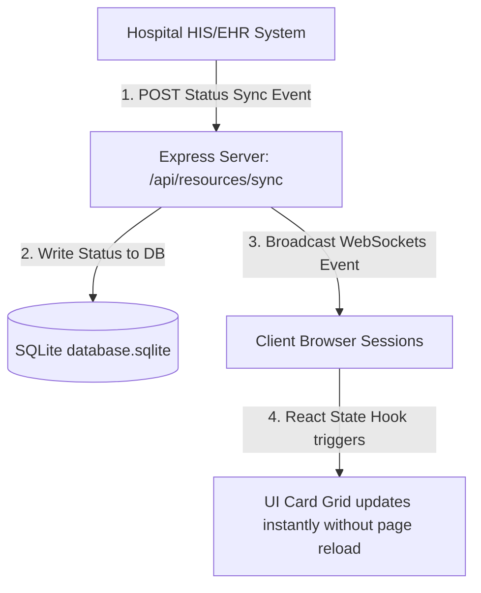

# Code Structure & Architecture: AuraBed Live MVP

This document outlines the folder layout, file responsibilities, and architecture of the AuraBed Live real-time hospital bed booking and telemetry application.

---

## 📂 Directory Layout

The workspace is organized as a unified monorepo containing a separate client (frontend) and server (backend) working together.

```text
HospitalBedAvailability/
├── client/                     # Frontend Application (React + Vite)
│   ├── src/
│   │   ├── main.jsx            # React mounting entry-point
│   │   ├── App.jsx             # Main UI views (Finder, Admin, API Sandbox)
│   │   └── index.css           # Styling system & Dark/Light mode tokens
│   ├── index.html              # HTML entry & SEO meta tags
│   ├── vite.config.js          # Vite build config
│   └── package.json            # Frontend dependencies (Lucide icons, Socket.io-client)
│
├── server/                     # Backend API & Database (Node.js + Express)
│   ├── src/
│   │   ├── index.js            # REST API endpoints & Socket.io server logic
│   │   └── database.js         # SQLite connection setup, schema init, & seed data
│   ├── database.sqlite         # Local SQLite database file (auto-generated)
│   ├── simulate_realtime.js    # Automated integration test for telemetry sync
│   └── package.json            # Server dependencies (Express, CORS, SQLite3, Socket.io)
│
├── package.json                # Root package configuration (manages dev tasks concurrently)
├── implementation_plan.md      # Architecture design plan (Mermaid diagrams)
├── walkthrough.md              # Test execution & manual verification checklist
└── code_structure.md           # This document
```

---

## 🔬 Core File Responsibilities

### 1. Root Workspace Configuration
* **[package.json](file:///c:/Users/cmgan/OneDrive/Documents/HospitalBedAvailability/package.json)**
  * Manages unified operations. 
  * Uses `concurrently` to run both the frontend Vite dev server (port 5173) and the backend Express server (port 3001) in a single terminal session (`npm run dev`).

### 2. Backend Server & Database
* **[server/src/database.js](file:///c:/Users/cmgan/OneDrive/Documents/HospitalBedAvailability/server/src/database.js)**
  * Creates connection hooks to `database.sqlite`.
  * Promisifies standard sqlite3 methods (`all`, `run`, `get`) into async/await helpers (`query`, `run`, `get`).
  * Sets up relational database schemas (`hospitals`, `categories`, `resources`, `reservations`) with foreign key constraints.
  * Seeds the tables with mock data for three hospitals, general/ICU beds, and doctor slots.
* **[server/src/index.js](file:///c:/Users/cmgan/OneDrive/Documents/HospitalBedAvailability/server/src/index.js)**
  * Boots the Express app and binds a Socket.io WebSocket server.
  * Declares public REST routes (fetch hospitals, list resources, post reservation requests).
  * Declares hospital admin routes (approve/decline reservations).
  * Declares the HIS Telemetry sync route (`POST /api/resources/sync`) that external hospital client systems hit to update bed availability.
  * Emits global WebSocket broadcasts (`resource_status_updated`, `new_reservation_request`) to keep all client browser sessions updated in real-time.

### 3. Integration Testing
* **[server/simulate_realtime.js](file:///c:/Users/cmgan/OneDrive/Documents/HospitalBedAvailability/server/simulate_realtime.js)**
  * A developer-facing script that acts as an external EHR system.
  * Dispatches an HTTP POST payload changing the status of a bed, and queries the database file directly to assert the change persisted correctly.

### 4. Frontend Application
* **[client/src/index.css](file:///c:/Users/cmgan/OneDrive/Documents/HospitalBedAvailability/client/src/index.css)**
  * Core layout styling written in Vanilla CSS.
  * Uses `@media (prefers-color-scheme: dark)` to automatically read user system settings and switch between premium dark/light HSL palettes.
  * Implements glassmorphism panel styling (`backdrop-filter`) and pulse animation routines (`@keyframes pulse`) for live indicators.
* **[client/src/App.jsx](file:///c:/Users/cmgan/OneDrive/Documents/HospitalBedAvailability/client/src/App.jsx)**
  * Contains the React UI logic.
  * Feeds Socket.io client hooks to listen to real-time events.
  * Displays three view tabs:
    1. **Public Finder**: Grid of hospitals, search filter, bed matrix visualizer, guest booking dialog, and local guest booking tracker using `localStorage`.
    2. **Hospital Admin Portal**: Grid of pending requests, actions to approve or deny bookings, and a manual bed status overrides controller.
    3. **EHR API Sandbox**: Form for developers to trigger sync events manually from the browser, with an output logs terminal displaying JSON payload responses.

---

## 📡 Live Telemetry Data Flow

Here is how data flows through the application when a bed status changes:


