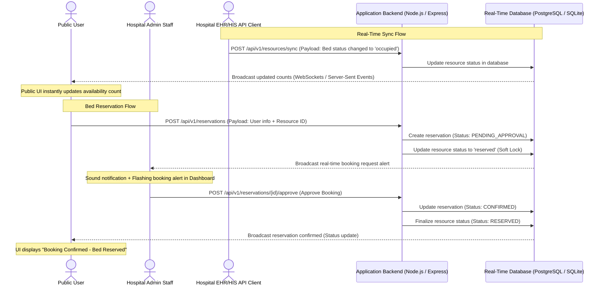
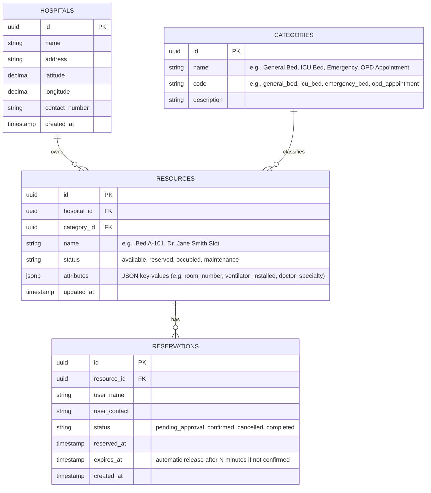

# Hospital Bed Availability & Real-Time Booking System (MVP)

We will build a real-time, globally scalable web application for tracking hospital bed availability and managing online bookings. The system will feature:
1. **Public User Portal**: A beautiful, responsive interface to search for hospitals, view bed availability in real-time, and request reservations.
2. **Hospital Admin Dashboard**: A real-time control room for hospital staff to manage incoming reservation requests (approve/deny) and update bed statuses manually.
3. **EHR/HIS API Simulator**: A developer-focused sandbox to execute API requests mimicking a hospital's internal electronic health record system, demonstrating live UI updates.
4. **Extensible Database Schema**: A flexible architecture that natively supports hospital beds, ICU beds, emergency beds, and doctor OPD appointments.

---

## Use Model & Real-time Flow Diagram

The diagram below illustrates the use model. It demonstrates:
- How hospital EHR/HIS systems update bed availability in real-time using the API.
- How public users see live changes and request reservations.
- How hospital admins receive live alerts and confirm bookings.



---

## Extensible Database Schema

To scale globally and support arbitrary categories (General Beds, ICU Beds, Emergency Beds, OPD Doctor Appointments, etc.) without altering the database structure, we use an **Entity-Attribute-Value (EAV)** or **JSONB Document** style design for resource metadata. 



### Extensibility Mapping Examples

#### 1. General Bed
- **Category Code**: `general_bed`
- **Resource Name**: `"Bed G-102"`
- **Attributes**:
  ```json
  {
    "ward": "General Ward A",
    "floor": "1st Floor",
    "room_number": "102"
  }
  ```

#### 2. ICU Bed
- **Category Code**: `icu_bed`
- **Resource Name**: `"ICU Bed 04"`
- **Attributes**:
  ```json
  {
    "icu_type": "Neonatal / Neonatal Intensive Care",
    "ventilator_connected": true,
    "oxygen_monitor": true
  }
  ```

#### 3. OPD Appointment (Doctor Slot)
- **Category Code**: `opd_appointment`
- **Resource Name**: `"Dr. Sarah Connor - Slot 3"`
- **Attributes**:
  ```json
  {
    "doctor_name": "Dr. Sarah Connor",
    "specialty": "Cardiology",
    "time_slot": "2026-06-12T14:30:00Z",
    "consultation_room": "Room 304B"
  }
  ```

---

## Technical Stack & Scalability Strategy

To build a globally scalable system, the stack is designed as follows:

| Component | Technology | Rationale for Worldwide Scaling |
| :--- | :--- | :--- |
| **Frontend UI** | **React / Vite** + **Vanilla CSS** | Static single-page assets hosted on Global Content Delivery Networks (CDNs) (Cloudflare, Vercel, Netlify) for sub-millisecond response times globally. |
| **Backend API** | **Node.js + Express** (REST APIs) | Can be deployed as serverless functions or containerized (Docker, Kubernetes) in multi-region environments (AWS ECS/EKS, Google Cloud Run) close to clients. |
| **Database** | **SQLite (Local Dev)** -> **PostgreSQL / Supabase (Prod)** | SQLite for rapid local prototyping. Production scales to Supabase (PostgreSQL) which provides row-level security (RLS), connection pooling, and built-in WebSockets for real-time DB changes. |
| **Real-time Sync** | **Socket.io / Server-Sent Events** | Local state broadcasts via Socket.io/WebSockets. Production scales to Redis Pub/Sub or Supabase Realtime to broadcast availability updates to millions of clients globally in real-time. |

---

## Proposed Changes (MVP Implementation)

For the MVP, we will create a full-stack Node.js + Vite application inside this workspace.

### 1. Project Initialization
- Create a unified monorepo structure:
  - `server/`: Express backend, database setup, WebSocket server, API endpoints.
  - `client/`: Vite + Vanilla CSS frontend for the three views (Public, Admin, API Sandbox).

### 2. Database Layer
- Local SQLite database (`database.sqlite`) initialized using SQLite3 or Prisma.
- Seed data containing:
  - 3 Hospitals (e.g., "City Central Hospital", "St. Jude Medical Center", "Metro Care Clinic").
  - Categories: `general_bed`, `icu_bed`, `opd_appointment`.
  - 10-15 resources pre-configured (primarily general beds to satisfy MVP requirements, with a few ICU/OPD resource stubs to demonstrate the extensible schema).

### 3. API Endpoints
- **Public Endpoints**:
  - `GET /api/hospitals` - Lists hospitals and active availability counts.
  - `GET /api/hospitals/:id/resources` - Lists details of all resources for a hospital.
  - `POST /api/reservations` - Creates a reservation request for a specific bed.
- **Hospital Admin Endpoints**:
  - `GET /api/reservations` - Fetches active reservation requests.
  - `POST /api/reservations/:id/approve` - Confirms a reservation request.
  - `POST /api/reservations/:id/decline` - Rejects a reservation request.
- **HIS Real-time Sync Endpoint**:
  - `POST /api/resources/sync` - Secures API endpoint used by hospitals to update a bed's status instantly.

### 4. UI Dashboard (Client Application)
A premium dashboard using modern design practices (dark/glassmorphism aesthetics, curated HSL color themes, CSS transitions, and pulse alerts).
- **Public View**:
  - Grid of hospitals with live status badges.
  - Interactive bed grid showing which beds are free or reserved.
  - A clean reservation checkout modal.
- **Hospital Control Dashboard**:
  - Live table of booking requests with a flash animation on new alerts.
  - Bed visualizer allowing manual toggling of status (Available, Maintenance, Occupied).
- **API Simulation Playground**:
  - Built-in UI form to simulate an external EHR system calling the `sync` endpoint.
  - Shows raw JSON payload and triggers live updates on both the Public View and Admin Dashboard.

## Open Questions

> [!IMPORTANT]
> Please review and provide feedback on the following questions:
>
> 1. **User Authentication**: For the MVP, do you want full user login/signup flows (using Firebase Auth or JWT), or is a simple form (asking for Name, Contact Number, and Reason for Reservation) sufficient for booking a bed?
> 2. **Real-time Protocol**: For local MVP demonstration, we will use WebSockets (via `socket.io` or standard `ws`). For the production database, do you have a preference between Firebase Firestore or Supabase (PostgreSQL)? Both support worldwide scaling and real-time updates.
> 3. **Design Aesthetic**: We plan to design the application with a premium dark-themed "glassmorphism" aesthetic with vibrant colored pulses indicating real-time updates. Do you prefer a dark-themed UI, light-themed, or a theme toggle?
> 4. **API Simulation**: Are you satisfied with a built-in API tester/sandbox in the UI, or would you prefer external `curl`/Postman API endpoints with a secret API key? We plan to implement both.

---

## Verification Plan

### Automated Verification
- We will include an automated script `tests/simulate_realtime.js` to perform batch API updates and verify database persistence.

### Manual Verification
1. Open two browser sessions side-by-side:
   - Left: Public Bed Availability Screen.
   - Right: Admin Dashboard & API Playground.
2. Trigger a bed update via the API Playground (e.g., Bed A-101 becomes `occupied`).
3. Verify that the Left screen instantly decreases availability counts and colors Bed A-101 as occupied without a page refresh.
4. Book a general bed from the Public Screen.
5. Verify that the Admin Dashboard flashes a new pending reservation alert immediately.
6. Approve the reservation in the Admin Dashboard, and verify the Public screen updates to show "Reserved" and the user receives a confirmation toast.
