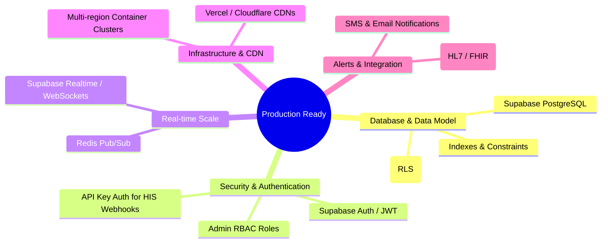

# Production Scaling & Enhancement Plan

This document outlines the roadmap to transition the AuraBed Live application from a local MVP into a highly available, secure, and globally scalable production-grade system.

---

## 🗺️ Enhancement Roadmap

---

## 1. Database Layer: SQLite ➡️ Supabase (PostgreSQL)
SQLite is excellent for local dev, but production requires a robust relational engine. We will migrate to **Supabase (PostgreSQL)**:
* **Foreign Key Cascade & Schema Constraints**: Recreate the four tables (`hospitals`, `categories`, `resources`, `reservations`) in PostgreSQL. 
* **Row-Level Security (RLS)**: Enforce RLS policies so public users can only read hospital counts, while hospital admin tables can only be read/written by authenticated hospital staff.
* **Database Indexing**: Add indexes on critical query lookup columns:
  * `resources(hospital_id, category_id, status)`
  * `reservations(resource_id, status)`
  * `hospitals(latitude, longitude)` (enable **PostGIS** for geographic hospital distance searches).

---

## 2. Authentication & Authorization (RBAC)
We must replace the MVP details form and local guest token model with strict authentication:
* **User Authentication**: Implement email/SMS verification via **Supabase Auth** or **Firebase Auth** so patients can log in securely to track bookings.
* **Role-Based Access Control (RBAC)**: Maintain an admin role mapping table. Admin users receive JWT claims indicating their `hospital_id`.
* **Securing Routes**: 
  * Public endpoints remain accessible with basic rate limits.
  * Admin endpoints (`/api/reservations/:id/approve` or manual override endpoints) will parse the request's JWT header to verify the admin belongs to the target hospital and possesses write access.

---

## 3. Webhook Ingestion Security (HIS/EHR Telemetry)
The `/api/resources/sync` endpoint must be heavily secured as it changes hospital bed registers:
* **API Key Authorization**: Implement API keys generated per hospital. The server will validate the `x-api-key` header against a hashed vault entry in the database.
* **HMAC Request Signing**: For advanced EHR systems, use SHA-256 HMAC request signing to verify payload integrity.
* **Strict Rate Limiting**: Limit sync inputs to prevent denial-of-service (DoS) vectors on the availability database (e.g., using `express-rate-limit` backed by Redis).

---

## 4. Scaling WebSockets (Real-time Broadcaster)
Local Socket.io broadcasts to in-memory sockets. If we scale to multiple server instances, we must coordinate broadcasts:
* **Redis Pub/Sub Adapter**: Bind Socket.io to a Redis adapter. When a server instance emits `resource_status_updated`, Redis distributes the event across all server instances globally.
* **Supabase Realtime**: Alternatively, bypass node WebSockets completely. The React client can subscribe directly to Postgres database changes via Supabase Realtime SDK, reducing server-side CPU utilization to zero.

---

## 5. Notifications & User Engagement
To ensure bookings translate to real patients arriving at beds:
* **SMS Integration (Twilio)**: Trigger instant SMS messages when:
  1. A patient requests a bed (receives a request ID).
  2. The hospital approves/declines (receives reservation confirmation & check-in details).
  3. A booking is approaching the 15-minute expiration mark.
* **Email Gateway (SendGrid)**: Send HTML confirmation receipts to patients and daily occupancy summaries to hospital administrators.

---

## 6. Global High Availability (Hosting)
* **Frontend Hosting**: Deploy Vite static assets to **Vercel** or **Cloudflare Pages** to cache layouts on edge networks globally.
* **Backend Ingestion**: Containerize the server using Docker and deploy to **AWS ECS (Fargate)** or **Google Cloud Run** in multi-region clusters, using a global load balancer to route requests to the nearest healthy server.
* **Automatic Expiration Daemon**: Set up a serverless cron job (e.g., AWS EventBridge or a Postgres pg_cron trigger) to run every minute, automatically releasing pending reservations that have exceeded their 15-minute soft-lock limit.
